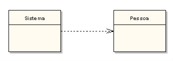
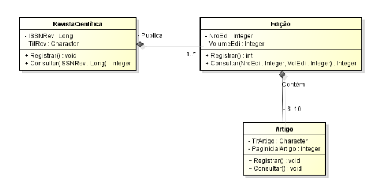

# Glossário de POO

Glossário de Programação Orientada a Objetos.

Índice
========

   * [Construtor](#construtor)
   * [Instanciação](#instanciação)
   * [Encapsulamento](#encapsulamento)
   * [Getters e Setters](#getters-e-setters)
   * [Assinatura de Método](#assinatura-de-método)
   * [Sobrecarga de Método](#sobrecarga-de-método)
   * [Escopo de variável e método](#escopo-de-variável-e-método)
      * [Escopo de classe](#escopo-de-classe)
      * [Escopo de objeto](#escopo-de-objeto)
   * [Palavras reservadas](#palavras-reservadas)
      * [Palavra reservada new](#palavra-reservada-new)
      * [Palavra reservada instanceof](#palavra-reservada-instanceof)
      * [Palavra reservada this](#palavra-reservada-this)
      * [Palavra reservada public](#palavra-reservada-public)
      * [Palavra reservada private](#palavra-reservada-private)
      * [Palavra reservada final](#palavra-reservada-final)
   * [Relacionamentos](#relacionamentos)
      * [Relacionamento de Dependência](#relacionamento-de-dependência)
      * [Relacionamento de Agregação](#relacionamento-de-agregação)
      * [Relacionamento de Composição](#relacionamento-de-composição)
      

Construtor
========

Um construtor é um processo pertencente a uma classe, tendo como objetivo a criação
de de um objeto. Mais especificamente é uma operação que é realizada quando um objeto
é instanciado, retornando assim no final da operação a nova instancia do objeto.
Uma classe pode definir nenhum ou vários construtores (caso nenhum seja definido, o 
construtor default é utilizado).

Ele que permite fazer inicializações no objeto assim que ele é declarado com o new. Os construtores são representados no Diagrama de Classes da UML pelo *create*.

Instanciação
========

A instanciação de uma classe é o processo utilizado para gerar uma materialização da
classe, sendo que essa materialização é denominada objeto. Para realizar a instanciação
é utilizada a palavra reservada [new](#palavra-reservada-new).

**Exemplo:**

```java
public class instanciacaoGlossario {

    public void pinguim() {
        instanciacaoGlossario exemploTeste = new instanciacaoGlossario();
        // executa código
    }

}
```

Encapsulamento
========

Encapsulamento é um dos princípios da orientação a objetos, sendo que seu objetivo
é ocultar os atributos de uma classe, assim protegendo o estado de cada objeto.

Getters e Setters
========

Getters e Setters são métodos de classe utilizados para aplicar o princípio
do encapsulamento. 
Os métodos getters servem para recuperar os atributos da classe. 
Os métodos setters servem para atribuir valores para os atributos da classe.

**Exemplo:**

```java
public class encapsulamentoGlossario {
    
    private int valor;
    
    public void setValor(int novoValor) {
        valor = novoValor;
    }
    
    public int getValor() {
        return valor;
    }
}
```

Assinatura de Método
========

A assinatura de um método demonstra a exclusividade de um método, ou seja, sua
identidade. A assinatura de um método é composta por seu nome, tipo de retorno,
tipo dos parâmetros e a quantidade de parâmetros. Desta forma, não pode haver
dois métodos pertencentes a mesma classe com todas as características 
definidas acima exatamente iguais.

Sobrecarga de Método
========

A sobrecarga de um método demonstra a capacidade de criação de vários métodos
como o mesmo nome, porém com diferenciações nos parâmetros e/ou tipo do retorno.

**Exemplo:**

```java
public class sobrecargaGlossario {

    public int pinguim(int a) {
        // executa código
    }
    
    public double pinguim(double a) {
        // executa código
    }

}
```

Escopo de variável e método
========

O escopo de uma variável ou método demonstra a visibilidade deste componente perante 
o sistema desenvolvido. De certa forma, podem haver dois tipos de escopos: o escopo 
de classe e o escopo de objeto.


Escopo de classe
--------

No escopo de classe o atributo ou método é pertencente a classe onde foi definido,
desta forma, não é necessário ter uma instância da classe para acessar o componente.

No Java, para representar uma variável ou método como sendo do escopo de uma classe é 
utilizada a palavra reservada static.

**Exemplo:**

```java
public class escopoGlossario {

    public static int valor = 10;
    
    public static void pinguim() {
        // executa código
    }

}
```

Escopo de objeto
--------

No escopo de objeto quaisquer métodos ou atributos pertencentes a classe que não
forem estáticos são de escopo do objeto. Assim, podem ser alterados individualmente
necessitando de instâncias do objeto. Caso não seja utilizada a palavra reservada
static os componentes são por padrão considerados como escopo de objeto.


Palavras reservadas
========

As palavras reservadas são comandos da linguagem que não podem ser utilizadas
para a definição de nomes de variáveis/métodos pois só podem ser usadas para 
realizar suas funções específicas.

Palavra reservada new
--------

A palavra reservada 'new' tem por função [instanciar](#instanciação) um objeto
a partir de uma classe. Esse objeto criado pode ser referênciado por uma variável
ou não.

**Exemplo:**

```java
public class palavrasReservadasGlossario {

    public void gato() {
        new palavrasReservadasGlossario();
        
        palavrasReservadasGlossario pr = new palavrasReservadasGlossario();
    }

}
```

Palavra reservada instanceof
--------

A palavra reservada 'instanceof' tem por função comparar se um objeto pertence ao mesmo 
tipo de determinada classe especificada. Deste modo, é retornado um valor booleano pela
comparação, sendo interessante utilizar esse comando em desvio de fluxos.

**Exemplo:**

```java
public class palavrasReservadasGlossario {

    public void tartaruga(Objeto obj) {
        
        if(obj instanceof palavrasReservadasGlossario) {
            // executa código
        }
        
    }

}
```

Palavra reservada this
--------

A palavra reservada 'this' é utilizada para um objeto fazer referência dele mesmo.
Geralmente é utilizado dentro de métodos para fazer referência a atributos do
próprio objeto. Também é utilizado nos métodos [setters](#getters-e-setters) para
diferenciar as variáveis locais dos atributos.

**Exemplo:**

```java
public class palavrasReservadasGlossario {

    private int valor;

    public void pegasus(int valor) {
        this.valor = valor;
        // executa código
    }

}
```

Palavra reservada public
--------

A palavra reservada 'public' é um modificador de acesso utilizado para definir a visibilidade
de um atributo ou método de uma classe, ou até mesmo da própria classe. Usando esta palavra 
reservada, os componentes marcados com a mesma serão visiveis por toda e qualquer classe do sistema.

Esta palavra chave é utilizada antes do tipo/retorno da variável/método.

**Exemplo:**

```java
public class palavrasReservadasGlossario {

    public double PI;
    
    public void dinossauro() {
        // executa código
    }
    
}
```

Palavra reservada private
--------

A palavra reservada 'private' é um modificador de acesso utilizado para definir a visibilidade
de um atributo ou método de uma classe. Usando esta palavra reservada os componentes da classe
serão visíveis apenas pela própria classe, permitindo apenas que o próprio objeto acesse
ou altere seus dados e/ou comportamentos.

**Exemplo:**

```java
public class palavrasReservadasGlossario {

    private double PI;
    
    private void hipogrífo() {
        // executa código
    }
    
}
```

Palavra reservada final
--------

A palavra reservada 'final' indica que o atributo marcado será apenas de leitura, ou seja, seu
valor é constante. Quando utilizado em variáveis primitivas, seu valor será realmente constante,
porém em objetos, a referência não pode ser mudada, mas isso não impede do estado do objeto ser
alterado.

Quando utilizada em métodos de uma classe, significa que o método não poderá ser sobrescrito, assim
como é possível definir uma classe como final, desta forma não permitindo que ela seja a classe
pai de outras classes.

**Exemplo:**

```java
final class palavrasReservadasGlossario {

    final double PI = 3.14d;
    
    final void godzilla() {
        // executa código
    }
    
}
```

Relacionamentos
========

Relacionamento de dependência
--------

O relacionamento de dependência de classes ocorre quando uma classe necessita
da instância de outra classe que que a mesma consiga realizar suas operações.
Desta forma, geralmente esse objeto é recebido como argumento pela classe para
que a operação seja realizada.

**Exemplo:**

```java
public class relacionamentosGlossario {

    public void vaca(ObjetoDependencia objDep) {
        // executa código
    }

}
```

**Exemplo UML:**



Relacionamento de Agregação
--------

A agregação é um relacionamento onde uma classe é composta por outras classes
internamente, ademais esses classes que compõem a classe podem existir mesmo
sem que a classe exista. Desta forma, os mesmos objetos fazem sentido mesmo que
esta classe que os compõem deixe de existir.

**Exemplo UML:**


Relacionamento de Composição
--------

A composição é um relacionamento onde uma classe é composta por outras classes
internamente, ademais os objetos que compõem a classe pertencem exclusicamente
a ela mesma, desta forma, as classes que compõem esta mesma naõ fazem sentido
caso esta classe não exista.

**Exemplo UML:**


